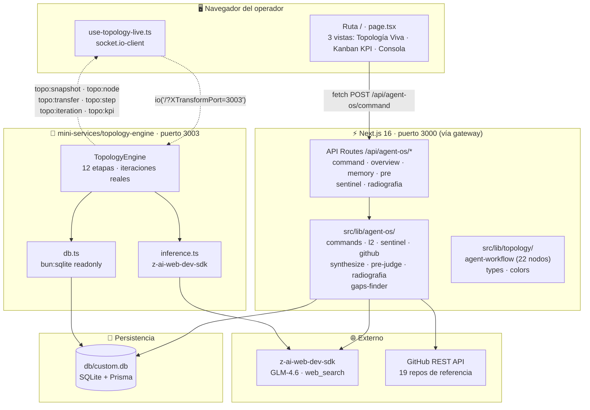
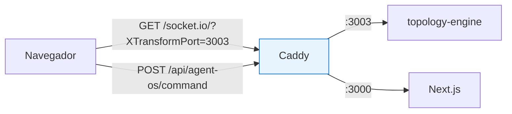
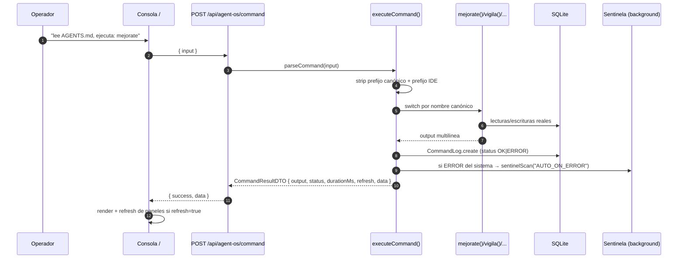

# 01 · Arquitectura del Sistema

> [← Índice](README.md) · [Topología Viva →](02-topologia-viva.md)

## Visión general

El Agent OS Console es una aplicación **Next.js 16 (App Router)** con una única ruta visible (`/`) y un **mini-service de streaming** dedicado. La regla de oro del entorno: **un solo puerto expuesto** (:3000 vía gateway Caddy); todo lo demás se accede con el query param `XTransformPort`.



## Decisiones de arquitectura

### 1. Ruta única, vistas internas

Solo `/` existe como ruta. Las tres vistas (Topología Viva, Kanban KPI, Consola Agent OS) son tabs internos — nada de routing adicional que fragmentar el estado.

### 2. Un puerto expuesto, gateway con `XTransformPort`



- REST: rutas relativas (`/api/...`) — nunca URLs absolutas.
- WebSocket: `io("/?XTransformPort=3003")`, path **siempre** `/`.

### 3. El mini-service es de **solo lectura + inferencia**

`topology-engine` lee la BD (`bun:sqlite` readonly: CommandLog, Finding, CycleRun, MemoryEntry, CostLedgerEntry) y ejecuta inferencias L2 reales. **Nunca escribe** en la BD operativa — la observabilidad no muta el sistema observado.

### 4. LLM-agnóstico por diseño (Regla P8)

Ningún controlador de negocio importa SDKs de proveedores. Toda inferencia pasa por el [L2 Control Plane](06-gobernanza-l2.md) (`src/lib/agent-os/l2.ts`): sanitización P12 → sandwich capa 3 → ledger inmutable de costos.

## Stack técnico

| Capa | Tecnología | Rol |
|:--|:--|:--|
| Framework | Next.js 16 · React 19 · TypeScript 5 | App Router, ruta única |
| UI | Tailwind CSS 4 · shadcn/ui (New York) · Lucide | Paleta Apple Light inmutable (P5): `#ffffff` / `#f5f5f7` / `#1d1d1f` |
| Canvas | **D3 v7** (port de living-topology-visualizer) | Topología viva: partículas bezier, órbita/embudo |
| Estado | Zustand (cliente) · hooks dedicados | `use-topology-live` con dedupe idempotente |
| Animación | Framer Motion | Kanban KPI, transiciones |
| RT | **socket.io 4.8** (server :3003 + client) | Eventos `topo:*` |
| Datos | Prisma 6 + SQLite (`db/custom.db`) | 16 modelos, ledgers append-only |
| IA | **z-ai-web-dev-sdk** (backend only) | GLM-4.6 chat + web_search |
| Calidad | ESLint 9 · verificación headless (P14) | `bun run lint` exit 0 obligatorio |

## Estructura de carpetas relevante

```
src/
├── app/
│   ├── page.tsx                  # Ruta única: 3 vistas + footer sticky
│   ├── layout.tsx                # Metadata · fonts · Toaster
│   └── api/agent-os/
│       ├── command/route.ts      # POST — dispatcher de comandos
│       ├── overview/route.ts     # GET  — estado global (KPIs PSIM)
│       ├── memory/route.ts       # GET  — memoria empírica P9
│       ├── sentinel/route.ts     # GET  — hallazgos + ciclos (polling 2s)
│       ├── radiografia/route.ts  # GET  — pipeline rayos-x (polling 2s)
│       └── pre/route.ts          # GET  — proposals PRE-v2.0
├── components/
│   ├── topology-live/            # agent-canvas · live-panels · kanban-kpi-board
│   └── agent-os/                 # 10 paneles de la consola + tour + CTA
└── lib/
    ├── agent-os/                 # núcleo del sistema (ver docs 03-07)
    └── topology/                 # escenario: 22 nodos · 43 enlaces · colores

mini-services/topology-engine/    # :3003 — engine + inference + db readonly
prisma/schema.prisma              # 16 modelos
db/custom.db                      # SQLite
scripts/                          # seed · sync · audits · mejorate-scan
```

## Flujo de un comando (request → respuesta)



> **Presupuesto de gateway (AP-032)**: todo comando debe responder en <25s. Los pipelines largos (radiografía, mejorate) corren en background o con concurrencia limitada; el frontend hace polling.
