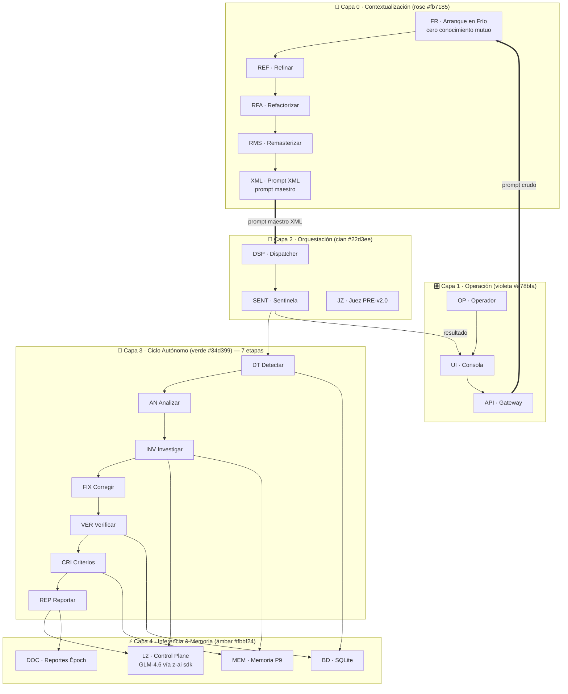
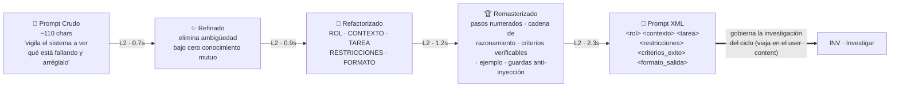
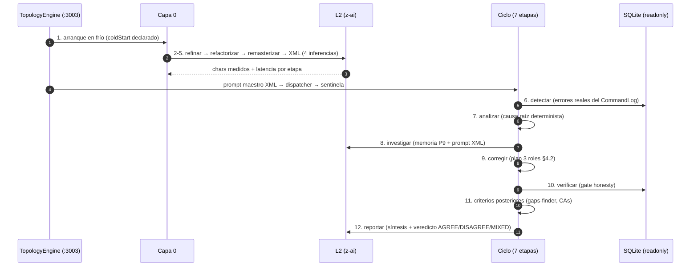

# 02 · Topología Viva — El Workflow Agéntico Observable

> [← Arquitectura](01-arquitectura.md) · [Comandos →](03-comandos.md)

La topología viva es la materialización del repo del operador [`living-topology-visualizer`](https://github.com/yosietserga/living-topology-visualizer) portada a este sistema: un **canvas D3** donde cada nodo es un órgano real y **cada partícula es una transferencia de contexto real** (inferencia, dato, control o reporte).

## Las 5 capas y los 22 nodos



**Regla de la capa 0 (el requisito del operador)**: el workflow arranca asumiendo que **el operador no sabe nada del tema y la IA tampoco**. Ese vacío se declara explícitamente (nodo FR) antes de operar — no hay conocimiento previo tácito.

## Canalización del prompt: crudo → XML

Cada transformación es una **inferencia L2 real** con chars y latencia medidos (visible como partículas violetas en el anillo rose):



- **Fallback honesto**: si una inferencia falla, `deterministicXml()` ensambla el XML localmente y la etapa se marca como no-L2 (P2).
- El **prompt maestro XML gobierna de verdad** la etapa *investigar*: viaja completo en el user content de la inferencia L2 del ciclo.

## La iteración completa: 12 pasos

Una iteración del motor (botón *Iterar x1* / *x3* / *Continuo*) ejecuta **12 pasos** con datos reales:



Métricas típicas verificadas en vivo: **39 transferencias · 9.5 KB de contexto · 6 inferencias L2 reales · ~30s** por iteración.

## Tipos de transferencia (partículas)

| Tipo | Color | Qué viaja | Ejemplo |
|:--|:--|:--|:--|
| `inference` | Violeta | Payload de inferencia L2 (chars in/out medidos) | `refinar → l2glm` (872→278 chars, 788ms) |
| `data` | Cian | Lecturas/escrituras de BD | `detectar → bd` |
| `control` | Gris | Señales de orquestación | `sentinela → detectar` |
| `report` | Verde | Reportes y memoria | `reportar → reportes` |

## Protocolo socket.io (`topo:*`)

```
Cliente → io("/?XTransformPort=3003")     (path SIEMPRE "/")
Server → topo:snapshot  { nodes, layers, links, iterations, kpis, findings, engine }
Server → topo:node      { id, status }            // activación/desactivación con pulso
Server → topo:transfer  { id, kind, charsIn?, charsOut?, latencyMs? }
Server → topo:step      { iterationId, step, status }
Server → topo:iteration { iteration }             // incluye promptStages[5] + coldStart
Server → topo:kpi       { kpi }                   // 12 contadores + veredictos
Server → topo:findings  { findings }
Server → topo:log       { level, message }
Cliente → topo:control  { action: run|x3|continuous|pause|resume|stop, paceMs? }
```

Controles de ritmo: **Lento / Normal / Rápido** (pausas entre iteraciones) · **Órbita / Embudo** (geometría del canvas) · foco de nodo con clic (ESC para salir).

## KPIs del tablero Kanban

8 tarjetas KPI con flash en cambio + kanban de iteraciones (14 columnas: En Cola + 12 etapas + Completadas) + kanban de hallazgos reales por lifecycle + sección "Canalización del Prompt — Crudo → XML" con las 5 tarjetas (chars, latencia L2, preview mono del XML, banner de arranque en frío).
