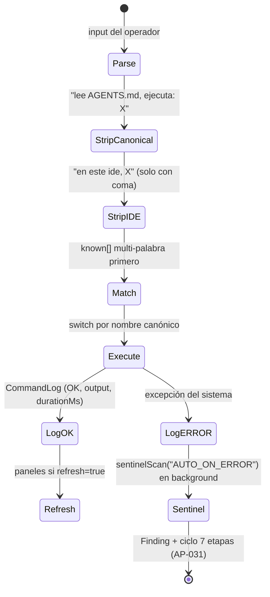

# 03 · Comandos Canónicos

> [← Topología Viva](02-topologia-viva.md) · [Modelo de Datos →](04-modelo-datos.md)

## Sintaxis universal

```
lee AGENTS.md, ejecuta: <comando> [parámetros]
```

- El prefijo canónico completo es opcional (se strippa si está).
- Prefijo de entorno **solo con coma**: `en este ide, cold run` (sin coma, `ide detect` es comando propio — AP-033).
- Todo comando no reconocido → `Comando desconocido` + status ERROR (y el sentinela lo clasifica como NO_DEFECT si es input del operador).

## Los 18 comandos (v1.9.0)

| # | Comando | Aliases | Qué hace (real) |
|:--|:--|:--|:--|
| 1 | `help` | `ayuda` | Lista canónica completa |
| 2 | `start` | `inicia` | Estado del sistema + próximos pasos |
| 3 | `cold run` | `coldrun`, `cold-run` | Arranque desde cero conocimiento mutuo: sanitización P12 + primer contacto |
| 4 | `mejorate` | `improve yourself` | **Scan GitHub 19 repos → síntesis L2 → juez PRE** ([doc 07](07-mejorate.md)) |
| 5 | `audit memory` | `audita` | Auditoría de la memoria empírica P9 |
| 6 | `sil trend` | `tendencia` | Tendencia de leadedgers/system improvement |
| 7 | `pre cycle` | `precycle` | Ciclo de gobernanza: Optimizador → Juez (ΔS) |
| 8 | `report` | `reporte` | Reporte époch inmutable con tabla AGREE/DISAGREE (P13) |
| 9 | `ui test` | `uitest` | Verificación de layout: 7 posiciones canónicas + footer sticky |
| 10 | `persona check` | `personas` | 8 personas × caso de uso (executive, operator, analyst, apprentice, demo-master, novato, power, adversario) |
| 11 | `ide [detect\|all]` | — | Auto-Activation Layer del entorno (ZCode + Preview) |
| 12 | `rayos-x <url>` | `radiografia`, `reverse-engineer` | Pipeline de 5 fases de ingeniería inversa (branding → 3D → negocio → reconstrucción → verificación) en background |
| 13 | `itera [N]` | — | N iteraciones del ciclo autónomo |
| 14 | `verify` | `verifica` | Re-verificación con gate honesty (exit code real) |
| 15 | `investiga <tema>` | `research` | Research Loop real: web_search (5 resultados) + síntesis L2 → memoria REFERENCE |
| 16 | `critica` | `auto-critica` | Auto-crítica vía L2 (Modo A: 3 debilidades reales) |
| 17 | `expected-check` | `expectativas` | Compara expectativa vs real (P15) — **CA-2 mide el último scan real de la DB** (AP-034) |
| 18 | `vigila` | `sentinel`, `ciclo`, `cicla` | **Ciclo Autónomo de Calidad**: scan de fuentes + hallazgos + ciclos en background ([doc 05](05-ciclo-calidad.md)) |

Soporte: `gaps-finder` (`gaps`, `sincroniza`), `l2-status` (`l2`).

## El dispatcher



**Inventario de casos del switch** (grep real sobre `commands.ts`): 60+ casos cubriendo los 18 comandos y todos sus aliases.

## Antipatrones de parsing erradicados

| AP | Defecto original | Fix |
|:--|:--|:--|
| AP-032 | Comandos largos (>25s) devolvían HTML 504 del gateway (`Unexpected token '<'`) | Pipelines en background + polling; scan paralelo x6 |
| AP-033 | El regex de prefijo IDE **sin coma** se comía `ide detect` → "detect desconocido" | Regex exige coma; `ide` queda como comando propio |
| AP-034 | `mejorate` con 0/19 repos seguía a synthesize sobre epoch rancio → exit 0 fabricado | Compuerta P2: aborta antes de L2, exit 1, causa raíz + remedio |

## Bitácora

Cada ejecución queda en `CommandLog` (command, args, output ≤4000, status OK/ERROR, durationMs) — es una de las **fuentes de evidencia del sentinela**.
