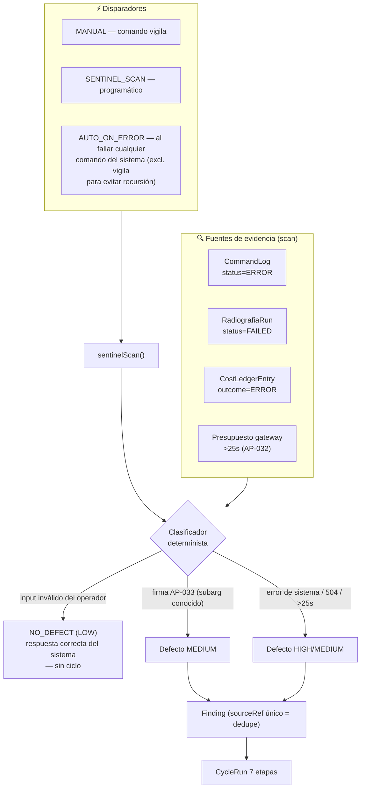
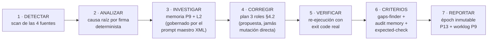
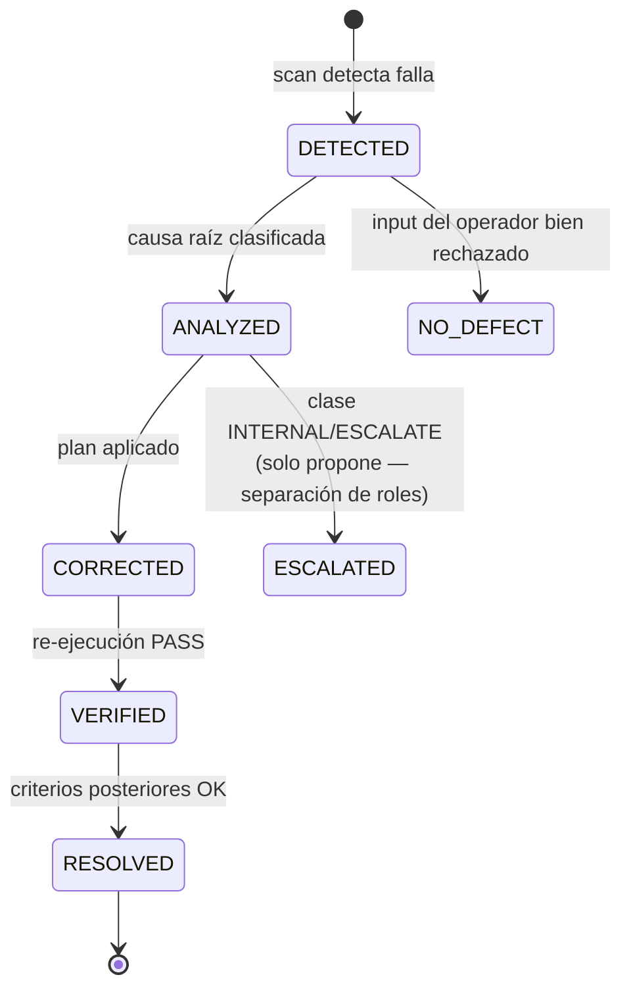
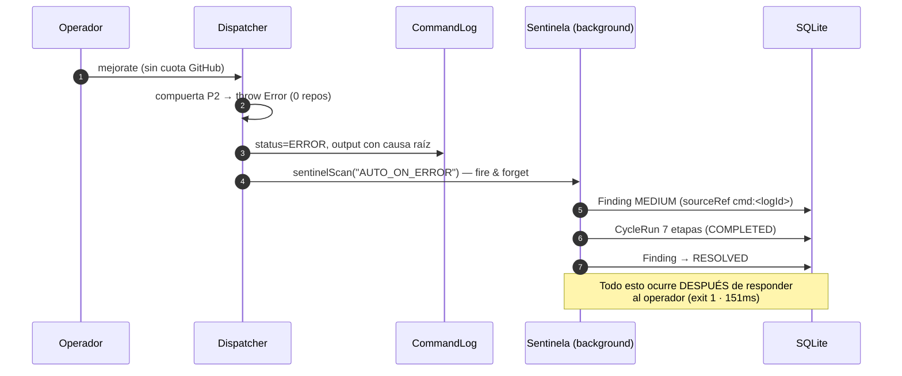

# 05 · Ciclo Autónomo de Calidad — El Sentinela

> [← Modelo de Datos](04-modelo-datos.md) · [Gobernanza y L2 →](06-gobernanza-l2.md)

**AP-031 (erradicado en v1.9.0)**: antes, cuando un comando fallaba o un pipeline entraba en FAILED, la falla quedaba en el log y **nadie la procesaba** — el operador humano era el detector de fallas del sistema. Ahora el sentinela (comando canónico 18º `vigila`) garantiza: *ninguna falla muere en el log*.

## Fuentes de evidencia y disparadores



## Las 7 etapas del ciclo



Cada etapa registra `{name, status: PASS|FAIL|ESCALATED, durationMs, evidence}` en `CycleRun.stages` (JSON) — evidencia honesta por etapa (P2).

## Ciclo de vida de un hallazgo



**Clases de corrección** (clasificador determinista):
- `NO_DEFECT` — el sistema respondió correctamente (input inválido).
- `HANDLED` — corrección ejecutable por el propio sistema.
- `PROPOSAL` — va al flujo PRE-v2.0 como `AdoptionProposal` (el sentinela nunca muta la constitución).
- `ESCALATE` — requiere al operador.

## AUTO_ON_ERROR en vivo (verificado E2E)



## Verificación de cierre de ciclos (queries reales)

Los ciclos cerrados son consultables por SQL directo — ejemplo real de esta sesión:

```
AUTO_ON_ERROR · COMPLETED · "Comando mejorate terminó en ERROR: [MEJORATE] scan: 0/19..."
MANUAL        · COMPLETED · "Radiografía FAILED: dominio inexistente — 7/7 etapas, AGREE"
MANUAL        · COMPLETED · "Presupuesto de gateway excedido: mejorate 39.6s (>25s, AP-032)"
```
