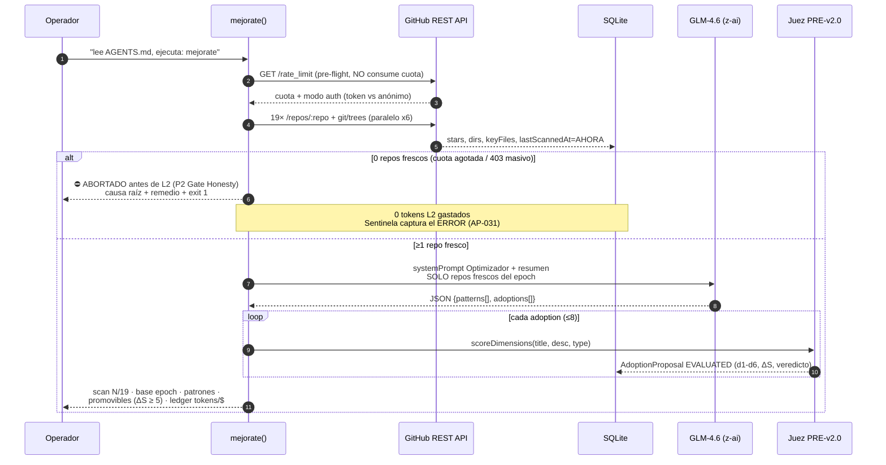
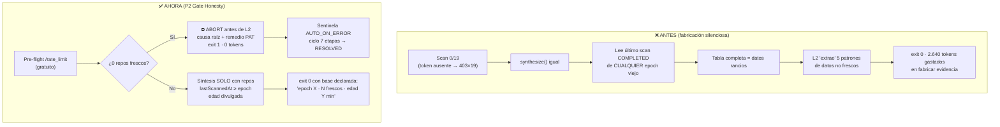

# 07 · Mejorate — Auto-Improvement Loop

> [← Gobernanza y L2](06-gobernanza-l2.md) · [← Índice](README.md)

`mejorate` es el comando de auto-mejora: escanea **19 repos de referencia** de ingeniería inversa (1.2M★ combinados) vía GitHub API, extrae patrones agénticos con L2 y propone adoptions que el [juez determinista](06-gobernanza-l2.md) evalúa.

## Pipeline completo



## Sub-comandos

| Comando | Qué hace |
|:--|:--|
| `mejorate` | Flujo completo scan → synthesize (con compuerta P2) |
| `mejorate scan` | Solo el scan (mismo gate: 0 repos → ERROR exit 1) |
| `mejorate synthesize` | Solo síntesis sobre el último scan (fail-fast si no es fresco) |
| `mejorate list` | Catálogo + último scan exitoso (epoch + repos) |

## AP-034 — La compuerta de honestidad (fix de workflow)

**El defecto real que el operador reportó** (salida `0/19 repos · 403×19 · 5 patrones extraídos · exit 0`):



### Las 4 correcciones de raíz

1. **Token en call-time** (`github.ts`): la constante a nivel de módulo congelaba el valor al importar — ahora se lee en cada llamada (`process.env.GITHUB_TOKEN ?? GH_TOKEN`).
2. **Circuit breaker de cuota**: sin token y `remaining === 0` → omite las llamadas destinadas a 403 (antes quemaba 19 requests y ~20s para colectar el muro de errores).
3. **Binding al epoch real** (`synthesize.ts`): el epoch de referencia es el **último scan** (no el último COMPLETED); fail-fast si FAILED o 0 repos; solo repos con `lastScannedAt` dentro del epoch; **edad divulgada** en el prompt del L2, la nota del ScanRun y la salida.
4. **Fallback determinista honesto**: si el L2 no estructura JSON, las proposals derivan de los **repos frescos del epoch** (antes reciclaba patrones viejos y el juez los rechazaba como duplicados — el origen de los ΔS negativos masivos).

## Verificación con token real (esta sesión)

```
[MEJORATE] scan: 19/19 repos escaneados read-only · 1,204,735★ totales
  Autenticación GitHub: token activo (cuota 4958/5000)

[MEJORATE] synthesize vía L2 (GLM-4.6 (z-ai), 16379ms)
  Base: epoch 1791092005 · 19 repos frescos · edad 0 min
  Patrones extraídos: 8 · Adoptions propuestas: 5
  Promovibles (ΔS ≥ 5.0): 0   ← el juez rechazó 5/5 por regresiones reales D1/D2
  Ledger: 1389+1432 tokens · $0.0093
```

> Sin token: 60 req/h por IP compartida (cada run consume ~38) → 403 masivo.
> Con `GITHUB_TOKEN` en `.env`: **5.000 req/h** — el scan de 19/19 es estable.
