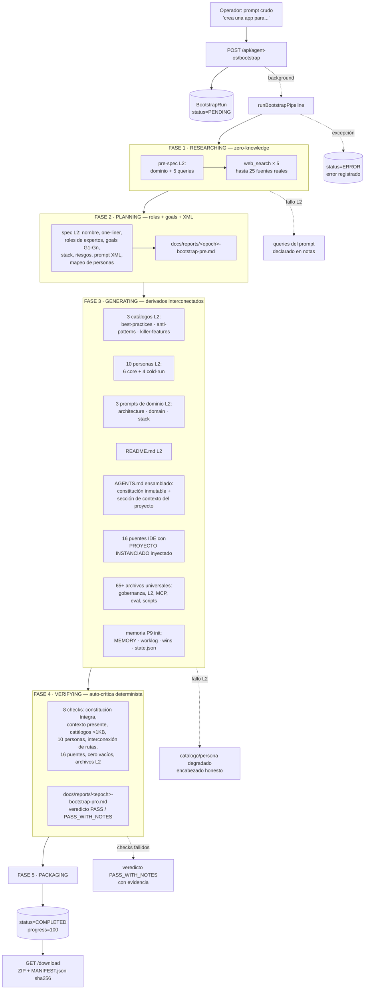
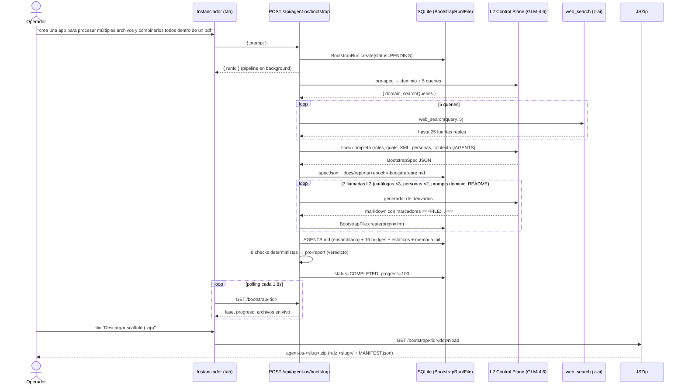
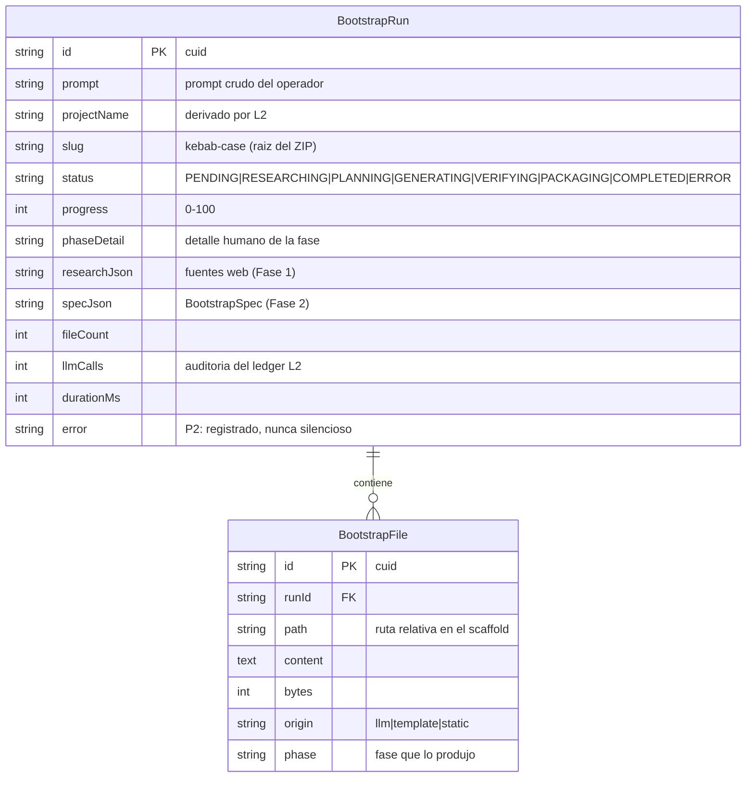
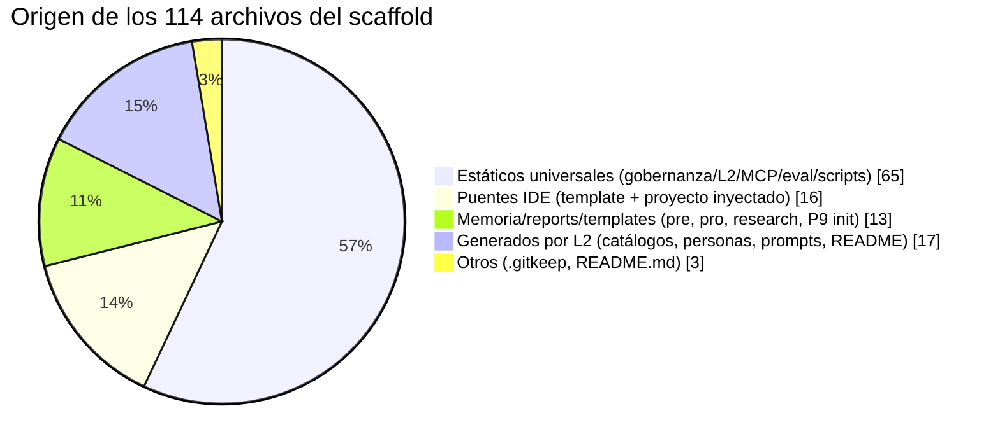

# 09 · Instanciador Zero-Shot (Protocolo 11)

> **Versión documentada**: v2.1.0 · Ruta: `/` → tab **Instanciador** · API: `/api/agent-os/bootstrap*`
> **Motor**: Protocolo 11 *Zero-Shot Project Bootstrap* del [agent-os-boilerplate](https://github.com/yosietserga/agent-os-boilerplate) (v1.10)

El Instanciador convierte la consola Agent OS en un **generador de scaffolds de condicionamiento conductual**. El operador describe la app que desea en un input tipo chatbot ("cuéntame qué app deseas crear") y el sistema **no genera la app**: genera `AGENTS.md` y todos los archivos derivados e interconectados que garantizan que cualquier LLM/SLM (Claude, GPT, Gemini, Cursor, Copilot…) que consuma el scaffold siga el workflow agéntico diseñado — ajustado al tópico del proyecto ingresado. La entrega es un **ZIP** con MANIFEST verificable.

## 1 · Qué hace (y qué no hace)

| Hace | No hace |
|:--|:--|
| Investiga el dominio del prompt (web search real, zero-knowledge) | No construye la app del proyecto |
| Refactoriza el prompt crudo a XML con roles de expertos | No inventa fuentes ni cifras (P2) |
| Genera catálogos, personas y prompts adaptados al dominio | No reescribe la constitución AGENTS.md (la instancia) |
| Ensambia constitución inmutable + contexto del proyecto | No deja archivos huérfanos (verificación de interconexiones) |
| Empaqueta 114+ archivos en ZIP con sha256 por archivo | No requiere que el operador sepa nada técnico |

## 2 · El bucle agéntico completo del pipeline

Cada instanciación recorre el mismo bucle agéntico que rige todo el sistema: **investigar → planear → pre-report → ejecutar → pro-report → auto-crítica**, con degradación honesta (P2) en cada fase.



**Degradación honesta (P2)**: si L2 o web_search fallan en cualquier fase, el pipeline no aborta la instanciación — inserta un *fallback declarado* (ej. catálogo con encabezado "VERSIÓN DEGRADADA") y lo lista en las notas del pro-report. Jamás inventa contenido.

## 3 · Secuencia end-to-end (operador → ZIP)



## 4 · Modelo de datos (2 tablas nuevas)



El ledger de costos (`CostLedgerEntry`) audita cada llamada L2 del pipeline con propósito `bootstrap-*` (tenant `agent-os-instancer`).

## 5 · Origen de cada archivo del scaffold (ejemplo real: Fusionador de Documentos)

Ejecución verificada del prompt de ejemplo — 114 archivos, 65.8 KB de constitución, 17 archivos L2, 23 fuentes:



```text
fusionador-documentos/
├── AGENTS.md                    ← constitución inmutable + "Contexto del Proyecto Instanciado"
├── README.md                    ← L2: puerta de entrada del scaffold
├── MANIFEST.json                ← sha256 por archivo + stats (generado en el ZIP)
├── CLAUDE.md · CLAUDE-CODE.md · CODEX.md · COPILOT-INSTRUCTIONS.md · CURSOR-RULES.md
│   GEMINI.md · opencode.md · .cursorrules · .clinerules · .windsurfrules
│   .cursor/ .github/ .roo/ .trae/ .antigravity/ .zcode/
│                                ← 16 puentes IDE con "PROYECTO INSTANCIADO" inyectado (Fase 3)
├── docs/
│   ├── catalogs/100-best-practices.md      ← L2: prácticas del dominio citando P1-P15
│   ├── catalogs/100-anti-patterns.md       ← L2: trampas del dominio con detección/prevención
│   ├── catalogs/100-killer-features.md     ← L2: features priorizadas trazadas a goals
│   ├── personas/{analyst,operator,executive,apprentice,experience-architect,demo-master}.md
│   │                            ← L2: 6 personas mapeadas a roles del dominio
│   ├── personas/cold-run/{adversario,edge,novato,power}.md
│   │                            ← L2: 4 simuladores de ataque adaptados
│   ├── prompts/{architecture,domain,stack}.md   ← L2: instrucciones del negocio
│   ├── research/<ts>-bootstrap-research.md ← evidencia Fase 1 (23 fuentes reales)
│   ├── reports/<epoch>-bootstrap-pre.md    ← plan ANTES de ejecutar
│   ├── reports/<epoch>-bootstrap-pro.md    ← veredicto + auto-crítica TRAS ejecutar
│   ├── memory/{MEMORY,worklog,wins-ledger}.md + state.json  ← P9 init en cero honesto
│   └── governance/ · l2-control-plane/ · security/ · patterns/ · polyglot/ …
│                                ← estáticos universales heredados
├── mcp/servers/ + mcp/skills/   ← 7 servidores MCP + 8 skills empaquetadas
├── packages/eval/               ← juez determinista PRE-v2.0 (S = 100×Σ(wi·Di))
└── scripts/                     ← 18 scripts operativos (investiga, critica, vigila…)
```

## 6 · Inyección en AGENTS.md (constitución + contexto)

`assembleAgentsMd()` **jamás reescribe** la constitución (estructura inmutable, Protocolo 11 Fase 2). Inserta dos cosas:

1. Línea de proyecto en el encabezado (tras la cita de apertura).
2. Sección `## Contexto del Proyecto Instanciado (Protocolo 11)` justo después del primer separador — es el condicionamiento conductual: misión, glosario, goals G1-Gn, roles de expertos, tabla de personas mapeadas, catálogos, prompts de dominio, restricciones de seguridad y reglas de ejecución del bucle.

```diff
 > **Versión:** 1.0.0 — Actualizada 2026-10-02
+> **PROYECTO INSTANCIADO:** Fusionador de Documentos — Herramienta profesional para combinar múltiples archivos en un único PDF
+> Instanciado por el Instanciador Zero-Shot (Protocolo 11) el 2026-10-04.

 ---

+## Contexto del Proyecto Instanciado (Protocolo 11)
+
+### Misión
+Proporcionar una herramienta profesional y segura que permita a los usuarios
+combinar múltiples archivos de diferentes formatos en un único documento PDF…
+
+### Goals del Proyecto
+1. Procesar al menos 10 formatos de archivo diferentes
+2. Combinar documentos en menos de 30 segundos para archivos de hasta 100MB
+…
+
+## 0. Directorio de Comandos Operativos   ← la constitución sigue intacta
```

Los 16 puentes IDE reciben el mismo bloque vía `bridgeContent()` — Protocolo 11 Fase 3 (*Zero-Prompt Workflow*): a partir de ese momento **todo prompt del operador pasa automáticamente por el workflow agéntico completo**, sin referenciar AGENTS.md en cada mensaje.

## 7 · Auto-crítica: los 8 checks del pro-report

| # | Check (determinista) | Umbral | Ejemplo real verificado |
|:--|:--|:--|:--|
| 1 | AGENTS.md constitución íntegra | > 15,000 bytes | PASS — 65,775 bytes |
| 2 | AGENTS.md contextualizado | sección + nombre de proyecto | PASS |
| 3-5 | Catálogos ×3 | ≥ 1,000 bytes c/u | PASS — 7,081 / 9,578 / 5,573 bytes |
| 6 | Personas del dominio | ≥ 6 de 10 vía L2 | PASS — 10/10 |
| 7 | Interconexión de rutas | toda `docs/**.md` referenciada existe | PASS — 6/6 |
| 8 | Puentes IDE | 16/16 con proyecto inyectado | PASS — 16/16 |
| + | Cero archivos vacíos | excluye `.gitkeep` | PASS (tras fix) |
| + | Archivos LLM | ≥ 10 | PASS — 17 |

Veredictos: `PASS` (0 fallos) · `PASS_WITH_NOTES (N)` — nunca se emite PASS sin evidencia (P2).

## 8 · API

| Endpoint | Método | Descripción |
|:--|:--|:--|
| `/api/agent-os/bootstrap` | `POST` | `{ prompt }` (10-2000 chars) → `{ runId }`; dispara el pipeline en background |
| `/api/agent-os/bootstrap` | `GET` | Historial (últimos 10 runs) |
| `/api/agent-os/bootstrap/[id]` | `GET` | Estado completo + spec + research + árbol de archivos; `?path=` devuelve el contenido de un archivo (preview) |
| `/api/agent-os/bootstrap/[id]/download` | `GET` | ZIP (solo si COMPLETED; 409 en otro caso) — raíz `<slug>/` + `MANIFEST.json` |

## 9 · Comportamiento ante fallos (P2 verificado en vivo)

| Fallo | Comportamiento |
|:--|:--|
| L2 caído en pre-spec | Queries derivadas del prompt crudo; nota honesta en el pro-report |
| web_search sin resultados | Sintetiza con conocimiento general **sin citar fuentes**; "(sin resultados — P2)" en research.md |
| L2 caído en un catálogo/persona | Archivo degradado con encabezado "VERSIÓN DEGRADADA (P2)"; el resto del scaffold sigue |
| Excepción del pipeline | `status=ERROR` con mensaje; el UI muestra el error (nada muere en el log) |
| Descarga antes de COMPLETED | HTTP 409 con estado y progreso actuales |

## 10 · Trazabilidad con la constitución

| Regla | Aplicación en el instanciador |
|:--|:--|
| P1 Read-After-Edit | El pro-report re-lee los archivos de la BD para los checks (no confía en memoria) |
| P2 Gate Honesty | Veredictos con evidencia; degradaciones declaradas; sin fuentes inventadas |
| P4 Sync atómica | Toda ruta referenciada en AGENTS.md existe en el ZIP (check 7) |
| P7 Zero-Placeholder | Cero archivos vacíos (excluye `.gitkeep`); prompts LLM prohíben TODO/placeholder |
| P8 LLM-Agnóstico | Todo vía Control Plane L2 (`infer()`/`webSearch()`); scaffold compatible con 10+ LLMs |
| P9 Memoria append-only | MEMORY/worklog/wins-ledger/state.json inicializados en cero honesto |
| P13 Auto-crítica | 8 checks deterministas post-generación |
| P15 Expected-first | El pre-report declara los criterios de verificación ANTES de generar |

---

*Documento generado en la iteración del Instanciador Zero-Shot (v2.1.0). Ejecución de referencia: run "Fusionador de Documentos" (114 archivos, 23 fuentes, 17 archivos L2, veredicto PASS_WITH_NOTES 1 check → .gitkeep corregido).*
