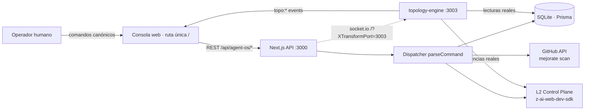

# Agent OS Console — Documentación Técnica

> **Repo**: `yosietserga/agent-os-console` (privado) · **Base de visualización**: [`yosietserga/living-topology-visualizer`](https://github.com/yosietserga/living-topology-visualizer) (público)
> **Versión documentada**: v2.0.0 · 19 comandos canónicos · 15 reglas cardinales + W-CTA

Sistema de control agéntico con **topología viva**: cada iteración ejecuta un ciclo real de calidad con inferencia L2, y todo el flujo (pasos, nodos, contextos, iteraciones) es observable en tiempo real.

## ¿Dónde leer cada cosa?

Este proyecto documenta en **dos formatos complementarios**, cada uno explotando sus ventajas:

| Formato | Ubicación | Ventajas que explota |
|:--|:--|:--|
| **Markdown** | `docs/*.md` (esta carpeta) | Versionable en git, diffable por PR, Mermaid renderizado nativo por GitHub, citable línea a línea en reviews |
| **HTML** | `public/docs/index.html` (servido en `/docs/index.html`) | Navegación lateral interactiva, secciones colapsables, diagramas Mermaid, botones de copiado, tarjetas KPI, enlace directo a la topología viva |

## Índice

1. [**Arquitectura del Sistema**](01-arquitectura.md) — Componentes, puertos, gateway, flujo request→respuesta
2. [**Topología Viva**](02-topologia-viva.md) — Las 5 capas, 22 nodos, 43 enlaces, 12 pasos, canalización del prompt crudo→XML, protocolo socket.io
3. [**Comandos Canónicos**](03-comandos.md) — Los 19 comandos, sintaxis universal, dispatcher y aliases
4. [**Modelo de Datos**](04-modelo-datos.md) — ER completo, memoria empírica P9, ledgers append-only
5. [**Ciclo Autónomo de Calidad**](05-ciclo-calidad.md) — Sentinela, 7 etapas, hallazgos, AUTO_ON_ERROR, anti-patrones erradicados
6. [**Gobernanza y L2**](06-gobernanza-l2.md) — Juez PRE-v2.0 (ΔS), circuit breaker, ledger de costos, PSIM K1-K5/W1-W8
7. [**Mejorate**](07-mejorate.md) — Scan GitHub → síntesis L2 → juez, compuerta de honestidad AP-034
8. [**Verificación del Bucle Agéntico**](08-verificacion-bucle.md) — Matriz PRE/POST de los 12 comportamientos esperados vs implementación (v2.0.0: comando `bucle`)

## Vista rápida del sistema

**Tres verdades del sistema** (Regla P2 — Gate Honesty):

1. Toda salida reporta lo **ejecutado real**, nunca lo simulado.
2. El LLM **redacta**; los **criterios deterministas deciden**.
3. Ninguna falla muere en el log (AP-031 erradicado): el sentinela la procesa.
